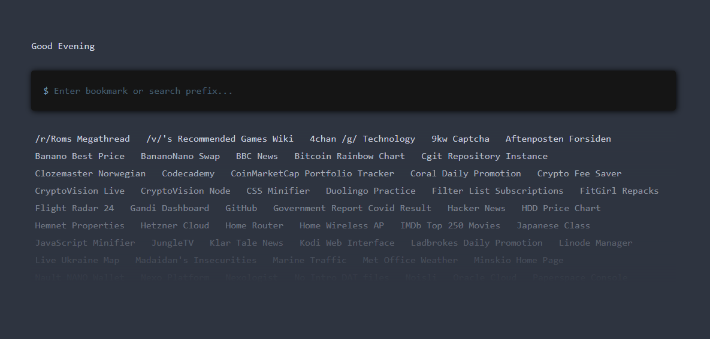

# Terminal Startpage

A Startpage that looks like a Terminal.



# Premade commands

reddit [subreddit]\
google [search]\
youtube [search]\
github [search]\
googletranslate [sentence] (or gt [sentence])\
googlemaps [search] (or gmaps [search])\
twitch [search]\
imdb [search]\
code [path/to/file.txt]\
echo <what_you_want_to_echo>\
clear\

# How to add commands ?

To add commands, go to the commands.js file in the sources.\
You will see some premade commands that you will be able to edit and you can create new ones, these commands are just functions.

```js

function google(cmd) {
    if (cmd != "google") {
        str = "";
        var parameters = cmd.split(" ").slice(1);
        for (var i = 0; i < parameters.length; i++) {
            str = str + "+" + parameters[i];
        }
        window.open("https://www.google.com/search?q=" + str);
    } else {
        window.open("https://www.google.com");
    }
}

function youtube(cmd) {
    if (cmd != "youtube") {
        str = "";
        var parameters = cmd.split(" ").slice(1);
        for (var i = 0; i < parameters.length; i++) {
            str = str + "+" + parameters[i];
        }
        window.open("https://www.youtube.com/results?search_query=" + str);
    } else {
        window.open("https://www.youtube.com/");
    }
}

function github(cmd) {
    if (cmd != "github") {
        str = "";
        var parameters = cmd.split(" ").slice(1);
        for (var i = 0; i < parameters.length; i++) {
            str = str + "+" + parameters[i];
        }
        window.open("https://github.com/search?q=" + str);
    } else {
        window.open("https://github.com/");
    }
}

gt=googletranslate
function googletranslate(cmd) {
    if (cmd != "googletranslate") {
        str = "";
        var parameters = cmd.split(" ").slice(1);
        for (var i = 0; i < parameters.length; i++) {
            str = str + "+" + parameters[i];
        }
        window.open("https://translate.google.com/?sl=auto&tl=en&text=" + str + "&op=translate");
    } else {
        window.open("https://translate.google.com/");
    }
}

gmaps=googlemaps
function googlemaps(cmd) {
    if (cmd != "googlemaps") {
        str = "";
        var parameters = cmd.split(" ").slice(1);
        for (var i = 0; i < parameters.length; i++) {
            str = str + "+" + parameters[i];
        }
        window.open("https://www.google.by/maps/search/" + str);
    } else {
        window.open("https://www.google.by/maps/");
    }
}

function twitch(cmd) {
    if (cmd != "twitch") {
        str = "";
        var parameters = cmd.split(" ").slice(1);
        for (var i = 0; i < parameters.length; i++) {
            str = str + "+" + parameters[i];
        }
        window.open("https://www.twitch.tv/search?term=" + str);
    } else {
        window.open("https://twitch.tv/");
    }
}

function imdb(cmd) {
    if (cmd != "imdb") {
        str = "";
        var parameters = cmd.split(" ").slice(1);
        for (var i = 0; i < parameters.length; i++) {
            str = str + "+" + parameters[i];
        }
        window.open("https://www.imdb.com/find?q=" + str);
    } else {
        window.open("https://imdb.com/");
    }
}

function spotify(cmd) {
    if (cmd != "spotify") {
        str = "";
        var parameters = cmd.split(" ").slice(1);
        for (var i = 0; i < parameters.length; i++) {
            str = str + "%20" + parameters[i];
        }
        window.open("https://open.spotify.com/search/" + str);
    } else {
        window.open("https://open.spotify.com/");
    }
}

function deezer(cmd) {
    if (cmd != "deezer") {
        str = "";
        var parameters = cmd.split(" ").slice(1);
        for (var i = 0; i < parameters.length; i++) {
            str = str + "%20" + parameters[i];
        }
        window.open("https://www.deezer.com/search/" + str);
    } else {
        window.open("https://www.deezer.com/");
    }
}

function code(cmd) {
    if (cmd != "code") {
        window.open("vscode://" + cmd.split(" ").slice(1)[0]);
    } else {
        window.open("vscode://");
    }
}

function reddit(cmd) {
    if (cmd != "reddit") {
        window.open("https://www.reddit.com/r/" + cmd.split(" ").slice(1)[0]);
    } else {
        window.open("https://www.reddit.com/");
    }
}

cls=clear
function clear(cmd) {
    document.getElementById('wrapper').innerHTML = "";
}

function echo(cmd) {
    block_log(cmd.split(" ").slice(1).join(" "))
}

```

# Theming

Want to customize the look of your Startpage ?\
We got you covered. You need to edit the terminal.css variables.

```css

:root {
    --main-bg-color: #547c99;
    --prompt-bg-color: #151515;
    --text-color: #6c99bb;
}

```
